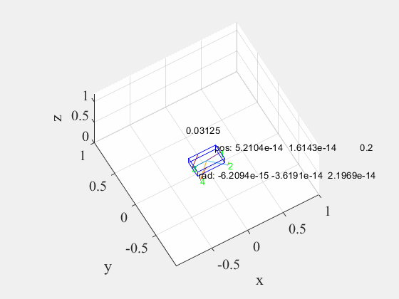

# Trajectory-Optimization-for-Legged-Robots 

Trajectory Optimization for Legged Robots by matlab and Casadi 
/优化在matlab下使用casadi实现
Change the casadi path at the beginning of the code after installing casadi
安装casadi 之后在代码开头更改casadi路径

# Trajectory Optimization for Legged Robots

# 四足机器人轨迹优化

This repository contains code for trajectory optimization of legged robots using MATLAB and CasADi.

优化在matlab下使用casadi实现

## Introduction / 简介

This project utilizes Multiple Shooting Transcription combined with the IPOPT solver for optimization problems.
本项目利用多重射击转录与 IPOPT 求解器结合进行优化问题的求解。

Multiple Shooting Transcription is a common optimization method, particularly suitable for discretizing continuous dynamic systems.
多重射击转录是一种常见的优化方法，特别适用于连续动态系统的离散化。

By dividing the continuous time horizon into multiple shorter time intervals and modeling the system within each interval, then optimizing over the entire time range, Multiple Shooting Transcription effectively solves continuous optimization problems.
通过将连续时间段分割成多个较短的时间段，并在每个时间段内对系统进行建模，然后在整个时间范围内进行优化，多重射击转录可以有效地解决连续优化问题。

IPOPT (Interior Point OPTimizer) is an open-source solver used for solving nonlinear continuous and discrete optimization problems. It is a powerful solver, particularly suitable for large-scale optimization problems, and performs well for nonlinear, non-convex optimization problems.
IPOPT（内点优化器）是一种用于解决非线性连续和离散优化问题的开源求解器。它是一种强大的求解器，特别适用于大规模优化问题，并且对于非线性、非凸优化问题表现良好。

This project combines these two methods by discretizing continuous dynamic systems using Multiple Shooting Transcription and using the IPOPT solver to optimize them. This approach finds widespread applications in robot control, motion planning, and other dynamic system modeling and optimization tasks.
本项目通过使用多重射击转录对连续动态系统进行离散化，并使用 IPOPT 求解器对其进行优化，结合了这两种方法。这种方法在机器人控制、运动规划和其他动态系统建模与优化方面具有广泛的应用。

## Installation

Before running the code, you need to install CasADi. After installing CasADi, you need to update the CasADi path in the code. 

安装casadi 之后在代码开头更改casadi路径

## Usage

1. Install CasADi.
2. Update the CasADi path in the code.
3. Run the MATLAB script for trajectory optimization.

## Example

Here is an example of trajectory optimization result for a quadruped robot:

## References

- CasADi documentation: [https://web.casadi.org/docs/](https://web.casadi.org/docs/)
- More information about trajectory optimization: [https://en.wikipedia.org/wiki/Trajectory_optimization](https://en.wikipedia.org/wiki/Trajectory_optimization)
